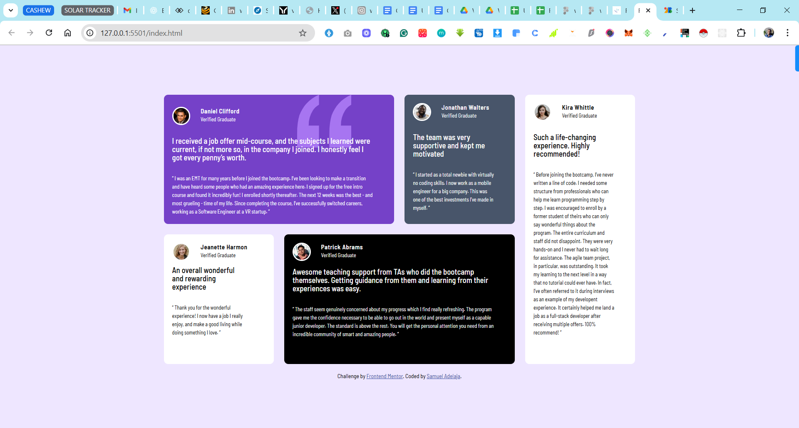

# Testimonials Grid Section

This is a solution to the [Testimonials Grid Section challenge on Frontend Mentor](https://www.frontendmentor.io/challenges/testimonials-grid-section-Nnw6J7Un7). This project involves creating a responsive grid layout to display multiple user testimonials with clean typography and balanced spacing.

## Table of Contents

* [Overview](#overview)

  * [The Challenge](#the-challenge)
  * [Screenshot](#screenshot)
  * [Links](#links)
* [My Process](#my-process)

  * [Built With](#built-with)
  * [What I Learned](#what-i-learned)
* [Author](#author)

---

## Overview

### The Challenge

Users should be able to:

* View a responsive testimonials grid section optimized for all screen sizes.
* Appreciate consistent and accessible layout, spacing, and text hierarchy.

### Screenshot



### Links

* 💻 [Live Site](https://your-live-site-url.com)
* 📂 [Solution on Frontend Mentor](https://github.com/samuel-faith/testimonials-grid-section-main)

---

## My Process

### Built With

* Semantic HTML5
* CSS Grid & Flexbox
* Mobile-first workflow
* plain CSS

### What I Learned

In this project, I improved my understanding of:

* Structuring content using CSS Grid for responsive layouts.
* Styling components with consistency and visual balance.
* Applying mobile-first principles and accessibility best practices.

Example of a testimonial card snippet:

```html
<article class="testimonial-card">
  <h2>Daniel Clifford</h2>
  <p>This testimonial stands out in the grid layout beautifully...</p>
</article>
```

```css
.testimonial-card {
  grid-column: span 2;
  background-color: var(--moderate-violet);
  color: white;
  padding: 2rem;
  border-radius: 10px;
}
```

---

## Author

* Website – [Samuel Adelaja](https://your-portfolio.com)
* Frontend Mentor – [@samuel-faith](https://www.frontendmentor.io/profile/samuel-faith)

---